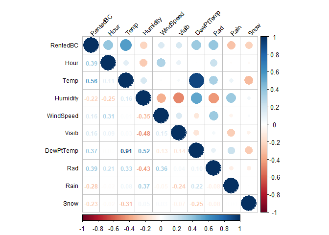
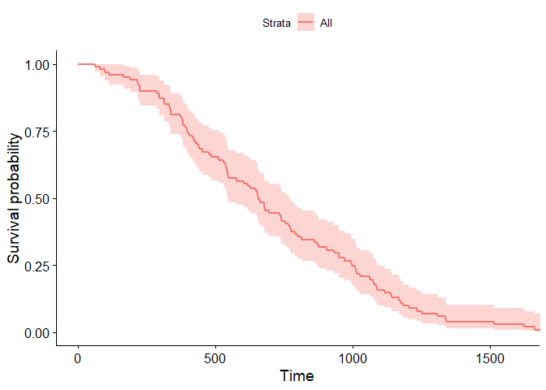

2023-06-29-3rd-Blog-Post
================
Kristina Golden
2023-06-30

Create a new .Rmd file where you will write the content of the post.
This should be in your \_Rmd folder and you’ll need to mimic much of
what was done in blog post 2

Write a post about what you consider the coolest thing you’ve learned
about programming in R. Include an example of it (or at least the code
to do it) in your post (for instance, if it was ggplot you could read in
a data set and create a cool plot).

Graphically, the coolest thing I have learned in R is the bubble graph
that graphs the correlations between multiple variables. The bubble
graph is a very interesting visual that allows the person doing the
analyses to make a quick determination between two or more variables
that are highly correlated. Computationally the coolest thing I have
learned is the weibull distribution and how to use it. In my internship,
I am using the weibull distribution to examine failure rates for
different components on the H-53K helicopter. We do this by looking at
beta. It is extremely interesting! I am really enjoying applying my
knowledge of R language and R code to analyze data that I pulled myself
and cleaned myself. Not only am I pulling the data, programming it, and
anlayzing it, I also get to make a recommendation about the preventative
inspection interval for different components of the aircraft. After the
data cleaning, the rest of steps are completed in R.

# Correlation Bubble Chart

``` r
setwd('C:/Users/kmgolden/Documents/GitHub/HW/HW8')
# Read in the data
bike <- read.csv('SeoulBikeData.csv')

# Make a binary variable
bike$BiRentedBC <- ifelse(bike$Rented.Bike.Count >= 700, 1,0)

# Reorder data, drop date, and rename variables
bike <- bike[, c(2, 15, 3:14)]
colnames(bike) <- c('RentedBC', 'BiRentedBC', 'Hour', 'Temp', 'Humidity', 'WindSpeed', 'Visib', 'DewPtTemp', 
                    'Rad', 'Rain',
                    'Snow','Seasons',
                    'Holiday', 'FunDay')

# Split data into train and test
train_in <- createDataPartition(1:nrow(bike), p = 0.75, list = FALSE)
train <- bike[train_in, ]
test <- bike[-train_in, ]

train2 <- train[, c(1, 3:11)]

# Set seed for reproduction
set.seed(10210526)

correlation <- cor(train2, method = "spearman")

# plot the bubbles on upper-right half
corrplot(correlation, type = "upper", tl.pos = "lt", 
         tl.col = "black", tl.cex = 0.75,
         tl.srt = 45,mar = c(2, 0, 1, 0))

# print values on lower-left half
corrplot(correlation, type = "lower", method = "number", 
         add = TRUE,
         diag = FALSE, tl.pos = "n", number.cex = 0.75)
```

<!-- -->
\# Weibull distribution  
Because the data I use to do the weibull distributions in my internship
are secured information, I have simulated one here.

``` r
def <- defSurv(varname = "time", formula = -13.7, scale = 1, shape = 0.49)
set.seed(1134)
dd <- genData(101)
dd <- genSurv(dd, def, digits = 0)
dd$status <- 1

fit <- survfit( Surv(time, status) ~ 1, data = dd )
ggsurvplot(fit, data = dd, palette = "FFC0CB")
```

<!-- -->
