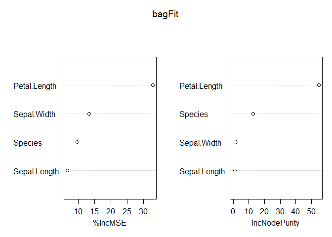

Blog Post 4
================
Kristina Golden
2023-07-21

# Required Packages

``` r
library(tidyverse)
```

    ## ── Attaching core tidyverse packages ──────────────────────── tidyverse 2.0.0 ──
    ## ✔ dplyr     1.1.2     ✔ readr     2.1.4
    ## ✔ forcats   1.0.0     ✔ stringr   1.5.0
    ## ✔ ggplot2   3.4.2     ✔ tibble    3.2.1
    ## ✔ lubridate 1.9.2     ✔ tidyr     1.3.0
    ## ✔ purrr     1.0.1     
    ## ── Conflicts ────────────────────────────────────────── tidyverse_conflicts() ──
    ## ✖ dplyr::filter() masks stats::filter()
    ## ✖ dplyr::lag()    masks stats::lag()
    ## ℹ Use the conflicted package (<http://conflicted.r-lib.org/>) to force all conflicts to become errors

``` r
library(caret)
```

    ## Warning: package 'caret' was built under R version 4.3.1

    ## Loading required package: lattice
    ## 
    ## Attaching package: 'caret'
    ## 
    ## The following object is masked from 'package:purrr':
    ## 
    ##     lift

``` r
library(randomForest)
```

    ## Warning: package 'randomForest' was built under R version 4.3.1

    ## randomForest 4.7-1.1
    ## Type rfNews() to see new features/changes/bug fixes.
    ## 
    ## Attaching package: 'randomForest'
    ## 
    ## The following object is masked from 'package:dplyr':
    ## 
    ##     combine
    ## 
    ## The following object is masked from 'package:ggplot2':
    ## 
    ##     margin

# Blog Post

The machine learning method that I find the most interesting is the
bagged method. I thought this method was interesting because it allows
for predictions and interpretation. I really appreciate being able to
see the variable importance measure. I had a meeting today at my
internship about machine learning. The CH-53 team does not do machine
learning, but they are interested in starting. Everybody else on the
team is an aerospace or a mechanical engineer, therefore they have zero
background knowledge in machine learning, R programming, or the science
behind data analytics at all. I am no expert, but I do have a surface
knowledge of machine learning. They were asking me questions about how
they can apply machine learning. One of the things they would like to be
able to do is predict a certain thing (can’t say), and see which
variables are contributing the most to that predicted value. They would
then like to focus their maintenance capabilities on that variable.
Bagging might be a way they can do this. I would do this through
%IncMSE.

``` r
# Create training and test data sets
set.seed(50)
train <- sample(1:nrow(iris), size = nrow(iris)*0.8)
test <- dplyr::setdiff(1:nrow(iris), train)
irisTrain <- iris[train, ]
irisTest <- iris[test, ]
```

``` r
bagFit <- randomForest(Petal.Width ~ ., 
                       data = irisTrain, 
                       mtry = ncol(irisTrain) - 1,
                       ntree = 200, 
                       importance = TRUE)

bagPred <- predict(bagFit, 
                   newdata = dplyr::select(irisTest, -Petal.Width))

bagRMSE <- sqrt(mean((bagPred-irisTest$Petal.Width)^2))

varImpPlot(bagFit)
```

<!-- -->
